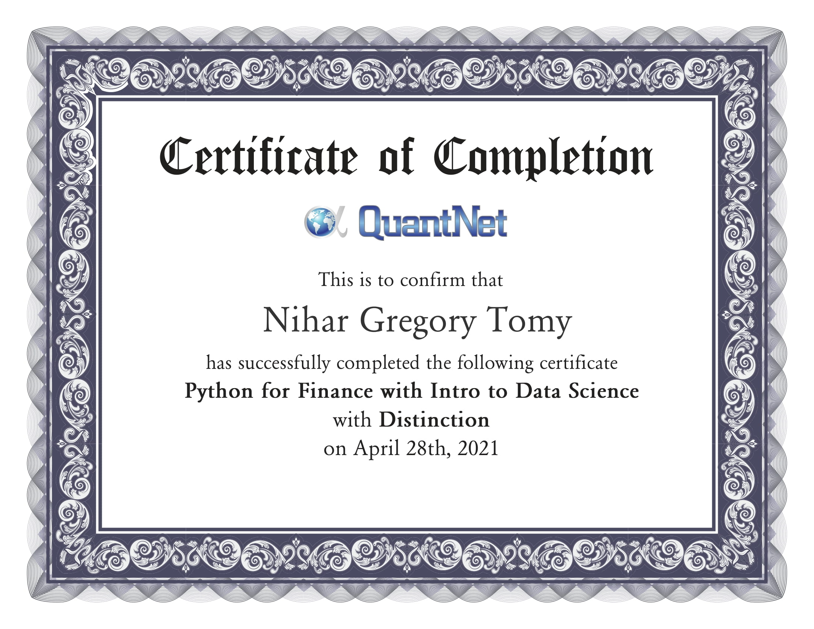

# asset-backed-security-modelling
Case study in Asset Backed Security modelling. Implemented abs with waterfall mechanism that calculates the cash-flows at each period. Furthermore, valued and rated instrument using Monte Carlo simulation.

